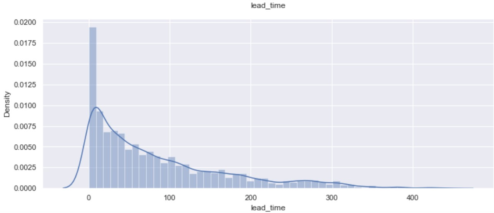

# **Project - Classification and Hypothesis Testing: Hotel Booking Cancellation Prediction**

---------------
## **Problem Statement**

**A significant number of hotel bookings are called off due to cancellations or no-shows.** Typical reasons for cancellations include change of plans, scheduling conflicts, etc. This is often made easier by the option to do so free of charge or preferably at a low cost. This may be beneficial to hotel guests, but it is a less desirable and possibly revenue-diminishing factor for hotels to deal with. Such losses are particularly high on last-minute cancellations.

The new technologies involving online booking channels have dramatically changed customers’ booking possibilities and behavior. This adds a further dimension to the challenge of how hotels handle cancellations, which are no longer limited to traditional booking and guest characteristics.

This pattern of cancellations of bookings impacts a hotel on various fronts:
1. **Loss of resources (revenue)** when the hotel cannot resell the room.
2. **Additional costs of distribution channels** by increasing commissions or paying for publicity to help sell these rooms.
3. **Lowering prices last minute**, so the hotel can resell a room, resulting in reducing the profit margin.
4. **Human resources to make arrangements** for the guests.

### **Objective**

This increasing number of cancellations calls for a Machine Learning based solution that can help in predicting which booking is likely to be canceled. INN Hotels Group has a chain of hotels in Portugal - they are facing problems with this high number of booking cancellations and have reached out to your firm for data-driven solutions. You, as a Data Scientist, have to analyze the data provided to find which factors have a high influence on booking cancellations, build a predictive model that can predict which booking is going to be canceled in advance, and help in formulating profitable policies for cancellations and refunds.

### **Data Description**

The data contains the different attributes of customers' booking details can be viewed in the Jupyter notebook.

## **Exploratory Data Analysis**

Plot the histogram and box plot for the variable `Lead Time` using the hist_box function is showed:

The Lead_time is right skewed on the its distribution. Many customers have made their booking in the same day of avrival. Also there are some customers made their booking more than 400 days in advance

As observed, there's a positive correlation between no_of_adults,and no_of_children vs. the average price per room. The more number of people, the more room space they will require so it will increasethe cost. There's a negative correlation between repeated guests vs average room price. The hotel might be giving some loyalty benefits to the customers. Also, there is a positive correlation between Lead_time and the booking_status. This indicates that higher the lead time higher are the chances of cancellation.

## **Summary and Recommendation:**
The analyses pointed at the importance of lead_time, market_segment_type_Online, no_of_special_requests, avg_price_per_room to be reconsiderd as the improvement recomendations to the business how how to minimize the number of cancelations as below:

1. Offer lower price for prepaid online booking with Non-refundable or higher price per room with cancelation option. Also offer credit for Corporate bookings and charge percentage penalty for cancellation. 
2. For royal customers since the cancellation among them is very less, consider to promote room upgrade and spcial discount to encourage them to come back
3. Offer more options for customers' special requests to reduce the possibilities of cancelations. They can do so by improving their customer service, such as being able to cater to most of the customers’ special requests.
4. Make sure to have a solid cancelation polycy in place and also applied for longer lead time in order to reduce hotel cancelation

